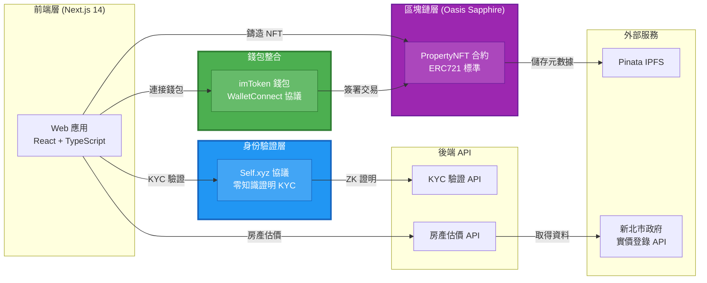
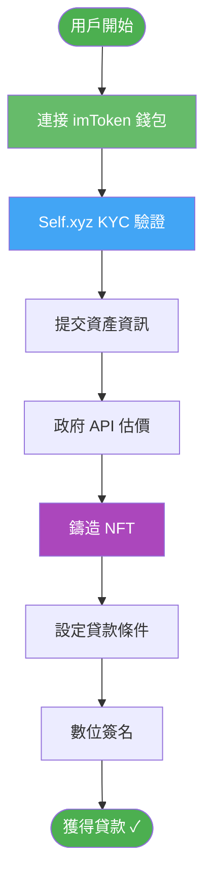
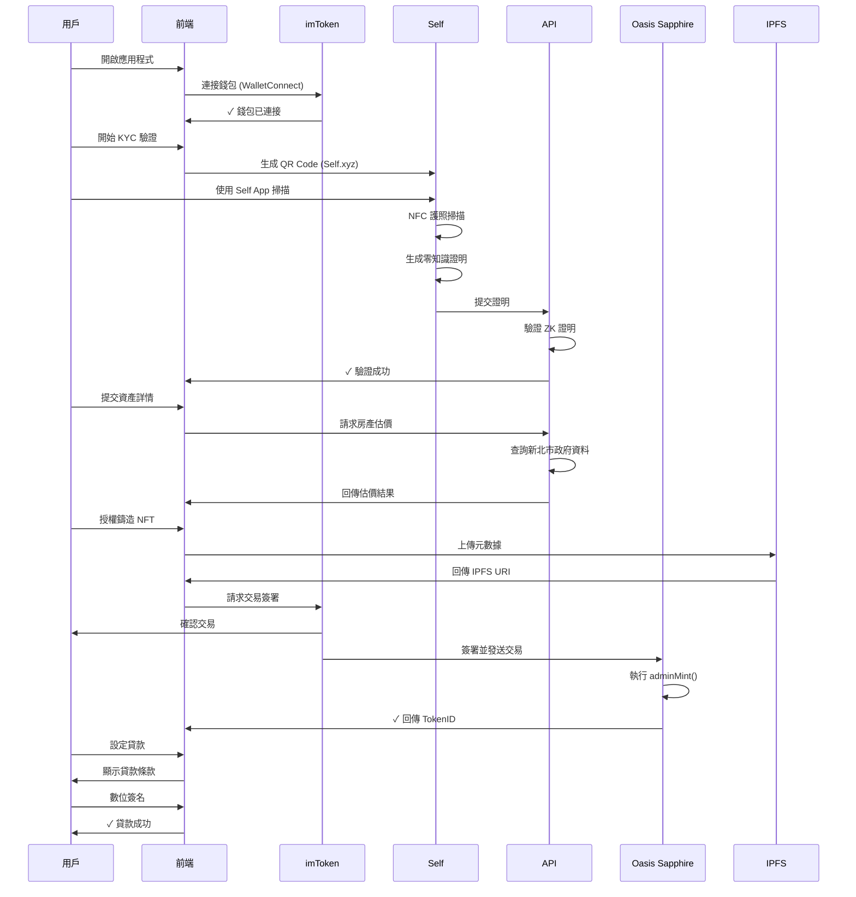

# 房地產 RWA 借貸平台

## 專案影片

<video src="assets/估值1B的獨角獸.mp4" controls width="600"></video>
網址：https://on-chain-re-lending.vercel.app/welcome
Figma: https://www.figma.com/design/N5elDr9ZVv1yPNvK01etyy/RWA-%E8%B3%87%E7%94%A2%E5%80%9F%E8%B2%B8%E5%B9%B3%E5%8F%B0-for-%E8%A9%95%E5%AF%A9?node-id=0-1&t=2gUNwatu2wPNFlYU-1

基於 Oasis Sapphire 區塊鏈的去中心化房地產代幣化與再貸款平台。本黑客松專案讓用戶能將真實世界資產 (RWA) 代幣化為 NFT，並立即獲得抵押貸款流動性。

## 系統架構圖



## 使用者流程圖



## 核心功能

### 🏠 資產代幣化

- 支援多種資產類型：房地產、藝術品、珠寶、車輛
- 使用政府實價登錄資料進行即時估價
- 基於 IPFS 的 NFT 元數據儲存
- 在 Oasis Sapphire 鏈上鑄造 ERC721 NFT

### 🔐 身份驗證 (Self Protocol 整合)

- 使用 Self.xyz 進行隱私保護身份驗證
- 透過 Self App 進行 NFC 護照掃描
- 零知識證明 (ZK-SNARKs) 技術
- 年齡驗證（最低 18 歲）及國籍揭露
- 符合法規要求的 KYC 流程

### 💼 錢包整合 (imToken 贊助商)

- 透過 WalletConnect 協議無縫連接
- 支援手機深度連結 (Deep-linking)
- 優先顯示的特色錢包
- 交易簽署與授權流程

### 💰 貸款管理

- 基於 NFT 價值的抵押貸款
- 貸款成數：50-60% LTV
- 彈性貸款期限：30/90/180/365 天
- 固定年利率：5%
- 數位簽名授權

### 📊 投資組合儀表板

- 即時錢包餘額追蹤
- RWA 資產庫存
- 活躍貸款總覽
- 交易歷史記錄

## 技術架構

### 前端技術

- **框架**: Next.js 14 (App Router)
- **語言**: TypeScript 5
- **UI 函式庫**: React 18
- **樣式**: Tailwind CSS 3.4 + Radix UI
- **圖示**: Lucide React
- **圖表**: Recharts
- **畫布**: Fabric.js (數位簽名)

### Web3 技術

- **區塊鏈**: Oasis Sapphire (Chain ID: 23295 測試網)
- **錢包**: Wagmi 2.19.1 + Viem 2.38.5
- **連接**: Web3Modal 5.1.11 + WalletConnect v2
- **合約**: PropertyNFT (ERC721)

### 後端 / API

- **執行環境**: Next.js API Routes
- **KYC**: Self.xyz SDK (@selfxyz/core 1.1.0-beta.7)
- **資料來源**: 新北市政府不動產實價登錄 API
- **儲存**: Pinata IPFS

### 狀態管理

- **客戶端**: React Hooks + SessionStorage
- **伺服器**: TanStack React Query 5.90.5
- **Web3**: Wagmi hooks

## 贊助商整合

### 🟢 imToken 整合

**整合內容**:

- **特色錢包**: 在 Web3Modal 錢包列表中優先顯示
- **錢包 ID**: `ef333840daf915aafdc4a004525502d6d49d77bd9c65e0642dbaefb3c2893bef`
- **協議**: WalletConnect v2
- **手機支援**: 深度連結支援
  - `imtokenv2://`
  - `imtoken://connect`
  - `imtoken://open`

**使用場景**:

- ✅ 錢包連接與身份驗證
- ✅ NFT 鑄造的交易簽署
- ✅ 貸款合約授權
- ✅ 資產轉移授權

**程式碼整合點**:

1. [Web3Modal 配置](src/config/web3modal.ts) - 特色錢包設定
2. [錢包連接頁面](src/app/page.tsx) - 手機偵測與深度連結
3. [NFT 鑄造](src/utils/propertyNFT.ts) - 透過 imToken 簽署交易

---

### 🔵 Self Protocol 整合

**整合內容**:

- **SDK 版本**: @selfxyz/core 1.1.0-beta.7
- **驗證類型**: 年齡 + 國籍 (KYC)
- **技術**: 零知識證明 (zk-SNARKs)
- **最低年齡**: 18 歲
- **驗證範圍**: "kyc-verification"

**使用場景**:

- ✅ 資產代幣化前的身份驗證
- ✅ 年齡與國籍揭露
- ✅ 符合監管要求
- ✅ 隱私保護的用戶認證

**程式碼整合點**:

1. [KYC 驗證頁面](src/app/kyc-verification/page.tsx) - QR Code 生成與驗證流程
2. [後端驗證器](src/app/api/kyc/self-verify/route.ts) - 證明驗證與認證
3. [資產代幣化流程](src/app/asset-tokenization/page.tsx) - 鑄造前的 KYC 狀態檢查

**Self.xyz 使用元件**:

- `SelfQRcodeWrapper`: 桌面版 QR Code 顯示
- `SelfAppBuilder`: 驗證請求配置
- `SelfBackendVerifier`: 伺服器端證明驗證
- Self App 手機深度連結支援

## 智能合約

### PropertyNFT 合約

- **網路**: Oasis Sapphire 測試網
- **Chain ID**: 23295
- **合約地址**: `0x077EA4EEB46Fdf1F406E108e52fd463764d73383`
- **標準**: ERC721
- **主要函式**:
  - `adminMint(address to, string tokenURI)`: 鑄造新的房產 NFT
  - `approve(address to, uint256 tokenId)`: 授權資產轉移
  - 標準 ERC721 方法

**區塊瀏覽器**: [Oasis Sapphire Explorer](https://explorer.oasis.io/testnet/sapphire)

## 完整使用流程



## 快速開始

### 環境需求

- Node.js 18+
- Yarn 套件管理器
- imToken 錢包 (手機版)
- Self App (用於 KYC 驗證)

### 安裝步驟

```bash
# 克隆專案
git clone <repository-url>
cd on-chain-re-lending

# 安裝依賴
yarn install

# 設定環境變數
cp .env.example .env.local
```

### 環境變數配置

在 `.env.local` 中設定以下變數:

```env
# WalletConnect
NEXT_PUBLIC_WALLETCONNECT_PROJECT_ID=your_project_id

# Self.xyz KYC
NEXT_PUBLIC_SELF_ENDPOINT=https://your-domain.com/api/kyc/self-verify
SELF_MINIMUM_AGE=18

# Google Maps
NEXT_PUBLIC_GOOGLE_MAPS_API_KEY=your_google_maps_key

# Pinata IPFS (選用)
NEXT_PUBLIC_PINATA_API_KEY=your_pinata_key
NEXT_PUBLIC_PINATA_SECRET_KEY=your_pinata_secret

# Development
NEXT_PUBLIC_URL=http://localhost:3000
```

### 開發指令

```bash
# 啟動開發伺服器
yarn dev

# 建置正式版本
yarn build

# 執行正式版本
yarn start

# 型別檢查
yarn lint
```

訪問 `http://localhost:3000` 即可使用應用程式。

### 使用 imToken 錢包

**桌面版**:

1. 在瀏覽器開啟應用程式
2. 點擊「連接錢包」
3. 使用 imToken 手機 App 掃描 QR Code
4. 授權連接

**手機版**:

1. 在手機瀏覽器開啟應用程式
2. 點擊「連接錢包」
3. 應用程式自動透過深度連結開啟 imToken
4. 授權連接並返回瀏覽器

### 使用 Self Protocol 進行 KYC 驗證

**桌面版**:

1. 前往 KYC 驗證頁面
2. 系統自動顯示 QR Code
3. 在手機開啟 Self App
4. 掃描 QR Code
5. 依照提示透過 NFC 掃描護照
6. 零知識證明生成並驗證

**手機版**:

1. 前往 KYC 驗證頁面
2. 點擊驗證按鈕
3. Self App 透過深度連結開啟
4. 透過 NFC 掃描護照
5. 驗證完成後返回瀏覽器

## 專案結構

```
src/
├── app/                          # Next.js App Router
│   ├── page.tsx                 # 錢包連接 (imToken)
│   ├── kyc-verification/        # Self.xyz KYC 整合
│   ├── asset-tokenization/      # 資產提交與估價
│   ├── loan-setup/              # 貸款配置
│   ├── wallet-dashboard/        # 投資組合總覽
│   └── api/                     # 後端 API 路由
│       ├── kyc/self-verify/     # Self Protocol 驗證
│       └── property-valuation/  # 新北市 API 整合
├── components/                   # React 元件
│   ├── ui/                      # Radix UI 元件
│   ├── AssetSubmission.tsx      # 資產表單
│   ├── NFTPreview.tsx           # NFT 顯示
│   └── DigitalSignatureDialog.tsx # 簽名畫布
├── config/
│   ├── web3modal.ts            # Wagmi + imToken 配置
│   └── contracts.ts            # Sapphire 合約地址
├── utils/
│   ├── propertyNFT.ts          # NFT 鑄造邏輯
│   └── ipfs.ts                 # Pinata 整合
├── abi/
│   └── PropertyNFT_Sapphire.json # 合約 ABI
└── types/                       # TypeScript 型別定義
```

## API 端點

### POST /api/kyc/self-verify

驗證 Self.xyz 零知識證明用於 KYC 驗證。

**請求 Body**:

```json
{
  "attestation": "...",
  "proof": "...",
  "publicSignals": "..."
}
```

**回應**:

```json
{
  "success": true,
  "message": "驗證成功",
  "disclosures": {
    "age": 25,
    "nationality": "TWN"
  }
}
```

### GET /api/property-valuation

從新北市政府 API 取得房產估價。

**查詢參數**:

- `address`: 完整房產地址

**回應**:

```json
{
  "success": true,
  "data": {
    "searchAddress": "新北市新莊區福壽街169巷34號",
    "matchCount": 12,
    "estimatedValue": 15000000,
    "priceRange": {
      "min": 14000000,
      "max": 16000000
    },
    "recentTransactions": [...]
  }
}
```

## 安全性

- **錢包安全**: 不儲存私鑰；由 imToken 處理金鑰管理
- **KYC 隱私**: 零知識證明確保護照資料不離開 Self App
- **智能合約**: 僅管理員可鑄造，符合 ERC721 標準
- **IPFS 儲存**: 透過 Pinata 進行不可變元數據儲存
- **API 安全**: 伺服器端驗證所有加密證明

## 授權條款

MIT License

## 聯絡方式

如有問題或需要支援，請在 GitHub 上開啟 issue。

---

🏆 本專案為黑客松作品，獲得 imToken 與 Self Protocol 贊助支持
